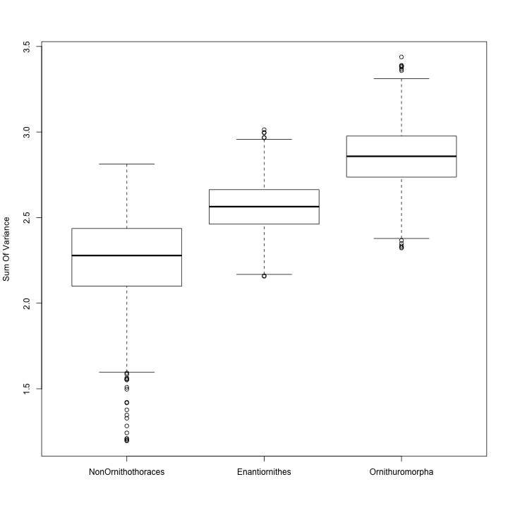
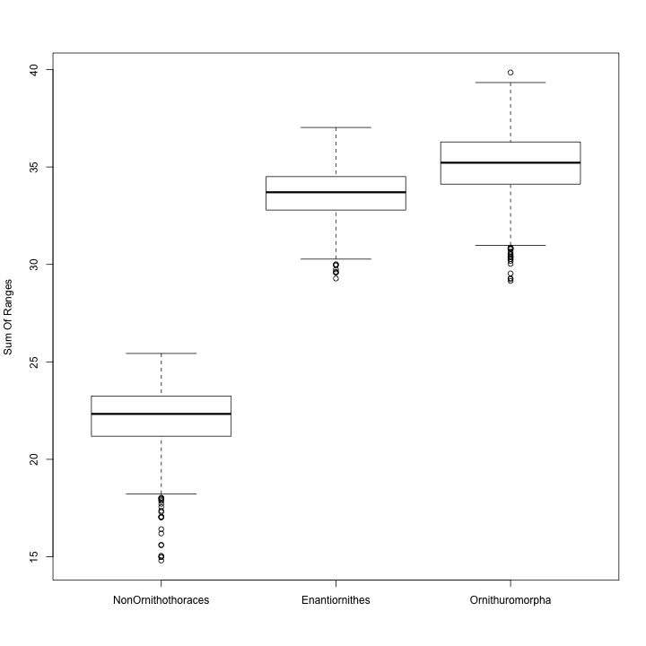
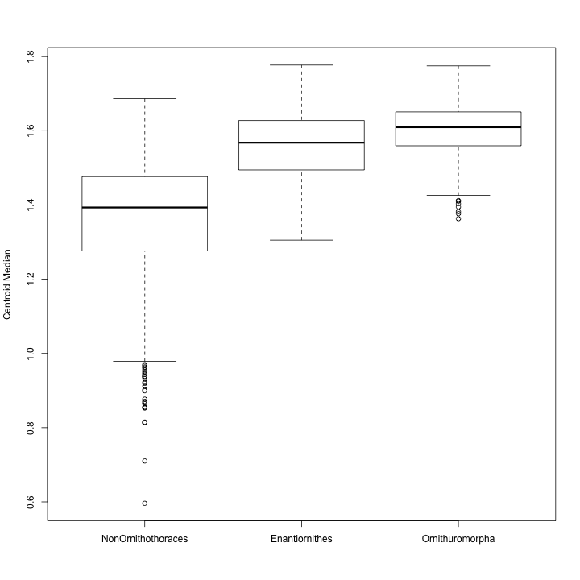

# TO DOS:
# PHYLO DISTANCES AS CONTROL
# JUST DO SHIT FOR EVERY MPT
# ADD REFERENCES!

# Introduciton

This R code performs comparative phylogenetic analysis of the pattern and mode of morphological disparity of Mesozoic birds. Varing methods are used to scaled the phylogeny, including the minimal branch length (mbl), equal and tip-dated methods. 1) a distance matrix was constructed by calculating a morphological distance between each pair of taxa using the MorphDistMatrix function. We chose the Maximum Observable Rescaled Distance (MORD) and the Generalised Euclidean Distance (GED) as the distance metrics, because they are more suitable to datasets containing fossils; the distance metrics were also calculated using the ??HSJ?? approach to account for inapplicable characters. All these different approaches can be applied by changing the Arguments in MorphDistMatrix () and Claddis::ordinate_cladistic_matrix (). These different methods produced essentially same results, and thus the mbl-scaled and MORD distance methods were detailed bellow, and corresponding results were present in figures. 2) First, we explore the pattern and mode of disparity of Mesozoic birds as a whole using three metrics (sum of variances and ranges, and median distance from centroids), and then conducted intergroup comparison; 3) A nonparametric multivariate analysis of variance (PERMANOVA) test was used to test whether the three avian groups were statistically seprated in morphospace; 4) we subdivided the character matrix into six anatomical subregions (skull, vertebral column, pectoral girdle, forelimb, pelvis, and hindlimb), and conducted aforementioned comparative analyses to explore whether these subregions demonstrate different patterns; 5) finally, we performed the character exhaustion analyses.

Test reference @R-base.

# Required packages

Before we begin we need to make sure the functions used in this file are installed in R by getting the packages from CRAN.


```r
install.packages(c("phytools", "paleotree", "devtools", "maps", "dispRity", "Claddis", "strap", "vegan", "geomorph", "devtools", "gtools", "knitr", "MASS", "phylobase", "magrittr", "kableExtra", "RColorBrewer"), dependencies = TRUE)
```

```
## Warning: package 'dispRity' is not available (for R version 3.6.3)
```

```
## Warning in download.file(url, destfile, method, mode = "wb", ...): URL 'https://cran.ma.imperial.ac.uk/bin/macosx/el-capitan/contrib/3.6/
## phytools_0.7-70.tgz': status was 'SSL connect error'
```

```
## Error in download.file(url, destfile, method, mode = "wb", ...) : 
##   cannot open URL 'https://cran.ma.imperial.ac.uk/bin/macosx/el-capitan/contrib/3.6/phytools_0.7-70.tgz'
```

```
## Warning in download.packages(pkgs, destdir = tmpd, available = available, : download of package 'phytools' failed
```

```
## Warning in download.file(url, destfile, method, mode = "wb", ...): URL 'https://cran.ma.imperial.ac.uk/bin/macosx/el-capitan/contrib/3.6/
## paleotree_3.3.25.tgz': status was 'SSL connect error'
```

```
## Error in download.file(url, destfile, method, mode = "wb", ...) : 
##   cannot open URL 'https://cran.ma.imperial.ac.uk/bin/macosx/el-capitan/contrib/3.6/paleotree_3.3.25.tgz'
```

```
## Warning in download.packages(pkgs, destdir = tmpd, available = available, : download of package 'paleotree' failed
```

```
## Warning in download.file(url, destfile, method, mode = "wb", ...): URL 'https://cran.ma.imperial.ac.uk/bin/macosx/el-capitan/contrib/3.6/
## devtools_2.3.2.tgz': status was 'SSL connect error'
```

```
## Error in download.file(url, destfile, method, mode = "wb", ...) : 
##   cannot open URL 'https://cran.ma.imperial.ac.uk/bin/macosx/el-capitan/contrib/3.6/devtools_2.3.2.tgz'
```

```
## Warning in download.packages(pkgs, destdir = tmpd, available = available, : download of package 'devtools' failed
```

```
## 
## The downloaded binary packages are in
## 	/var/folders/94/0hy28q9n6ljd05jw1lc1db_c0000gq/T//RtmpMzmpDq/downloaded_packages
```

We also require some newer functions from the latest versions of the Claddis and dispRity packages so we will install these directly from GitHub.


```r
devtools::install_github("graemetlloyd/Claddis")
```

```
## Downloading GitHub repo graemetlloyd/Claddis@HEAD
```

```
##   
   checking for file /private/var/folders/94/0hy28q9n6ljd05jw1lc1db_c0000gq/T/RtmpMzmpDq/remotes2c836d1272b/graemetlloyd-Claddis-5ef5842/DESCRIPTION ...
  
v  checking for file /private/var/folders/94/0hy28q9n6ljd05jw1lc1db_c0000gq/T/RtmpMzmpDq/remotes2c836d1272b/graemetlloyd-Claddis-5ef5842/DESCRIPTION (546ms)
## 
  
-  preparing Claddis: (900ms)
##   
  
   checking DESCRIPTION meta-information ...
  
v  checking DESCRIPTION meta-information
## 
  
-  checking for LF line-endings in source and make files and shell scripts
## 
  
-  checking for empty or unneeded directories
## 
  
-  looking to see if a data/datalist file should be added
## 
  
-  building Claddis_0.6.5.tar.gz
## 
  
   
## 
```

```r
devtools::install_github("TGuillerme/dispRity", ref = "release")
```

```
## Skipping install of 'dispRity' from a github remote, the SHA1 (10120043) has not changed since last install.
##   Use `force = TRUE` to force installation
```

We can then load some libraries into memory, although most functions will be called with the following syntax: packagename::functionname.


```r
library(dispRity)
```

# Loading data

Before any analyses can be perfomed the raw data must be imported into R. This includes our discrete character data, phylogenetic hypotheses and information on our taxon ages.

First we will load the key raw data from the GitHub data folder into memory.


```r
nexus.data <- Claddis::read_nexus_matrix("https://raw.githubusercontent.com/graemetlloyd/ProjectAncientBeak/main/data/matrix.nex")
tip.ages <- utils::read.table("https://raw.githubusercontent.com/graemetlloyd/ProjectAncientBeak/main/data/tipages.txt", sep = ",", header = TRUE, row.names = 1)
mpts <- ape::read.nexus("https://raw.githubusercontent.com/graemetlloyd/ProjectAncientBeak/main/data/mpts.nex")
tip.dated.tree <- ape::read.nexus("https://raw.githubusercontent.com/graemetlloyd/ProjectAncientBeak/main/data/tipdated.tre")
```

We can also add a strict consensus tree for our parsimony data using the consensus function in the ape package.


```r
sc.tree <- ape::consensus(mpts)
```

We also need to tweak a taxon name in the tip-dated tree to make sure these all match the rest of the data.


```r
tip.dated.tree$tip.label[tip.dated.tree$tip.label == "Mengciusornis_dentatus"] <- "Mengciusornis"
```

Next we can define our three main taxon groupings: Enantiornithes, Ornithuromorpha and the remaining taxa labelled simply non-Ornithothoraces). We will use these later to subset our data.


```r
Enantiornithes <- c("Boluochia", "Concornis", "Elsornis", "Eoalulavis", "Cathayornis", "Eocathayornis", "Eoenantiornis", "Gobipteryx", "Longipteryx", "Longirostravis", "Neuquenornis", "Pengornis", "Eopengornis", "Chiappeavis", "Parapengornis", "Protopteryx", "Rapaxavis", "Shanweiniao", "Vescornis", "Piscivorenantiornis", "Linyiornis", "Sulcavis", "Bohaiornis", "Longusunguis", "Shenqiornis", "Zhouornis", "Parabohaiornis", "Fortunguavis", "Pterygornis", "Cruralispennia", "Monoenantiornis", "Shangyang", "Mirusavis", "Gretcheniao", "Dunhuangia", "Qiliania")
Ornithuromorpha <- c("Archaeorhynchus", "Schizooura", "Bellulornis", "Jianchangornis", "Songlingornis", "Longicrusavis", "Apsaravis", "Hongshanornis", "Archaeornithura", "Parahongshanornis", "Tianyuornis", "Patagopteryx", "Yixianornis", "Piscivoravis", "Iteravis", "Gansus", "Ichthyornis", "Hesperornis", "Parahesperornis", "Enaliornis", "Baptornis_advenus", "Baptornis_varneri", "Vegavis", "Mengciusornis", "Yanornis", "Similiyanornis", "Abitusavis", "Eogranivora", "Xinghaiornis", "Dingavis", "Vorona")
NonOrnithothoraces <- c("Dromaeosauridae", "Archaeopteryx", "Jeholornis", "Jinguofortis", "Chongmingia", "Sapeornis", "Confuciusornis_sanctus", "Changchengornis_hengdaoziensis", "Eoconfuciusornis_zhengi", "Confuciusornis_dui", "Yangavis")
```

We can now use this information to make a formal taxonGroups object for use in Claddis.


```r
taxon_groups <- list(Enantiornithes = Enantiornithes, Ornithuromorpha = Ornithuromorpha, NonOrnithothoraces = NonOrnithothoraces)
class(taxon_groups) <- "taxonGroups"
```

# Time-scaling phylogenetic trees

Before we can use our parsimony trees these need to be assigned branch lengths reflecting their durations and a root age "pinning" their origin in time. The tip-dated tree also needs the latter as this is not standard output from software like BEAST, MrBayes or RevBayes (as they typically assume the most recent taxon will be extant, i.e., 0 Ma old).

Parsimony trees can be time-scaled in R in simple ad-hoc ways, such as setting a minimum branch= length ("mbl").


```r
time.trees <- lapply(mpts, function(x) paleotree::timePaleoPhy(x, tip.ages, type = "mbl", vartime = 1))
time.sc.tree <- paleotree::timePaleoPhy(sc.tree, tip.ages, type = "mbl", vartime = 1)
```

Alternatively, after setting every internal node as old as its' oldest descendant taxon - a process which generates multiple problematic zero-length branches (zlbs) - these zlbs can be assigned positive duration by sharing it equally ("equal") with the first preceding branch of positive duration.


```r
time.trees2 <- lapply(mpts, function(x) paleotree::timePaleoPhy(x, tip.ages, type = "equal", vartime = 1))
time.sc.tree2 <- paleotree::timePaleoPhy(sc.tree, tip.ages, type = "equal", vartime = 1)
```

Our tip-dated tree already has branch durations, but still needs a root age assignment. Here, as we have two extant taxa (Anas, Gallus) we can simply set this using the maximum path-length (root to Anas (or Gallus) path) in millions of years.


```r
tip.dated.tree$root.time <- max(diag(ape::vcv(tip.dated.tree))) # Set root age as max path length due to extant taxa
```

# Pruning crown bird taxa

As our analysis is focused on the Mesozoic and sampling of Neornithes - the bird crown - is severely limited we need to prune these taxa.


```r
crown.taxa.to.remove <- c("Gallus", "Anas")
stem.time.trees <- lapply(time.trees, function(x) Claddis::drop_time_tip(x, tip_names = crown.taxa.to.remove))
stem.time.trees2 <- lapply(time.trees, function(x) Claddis::drop_time_tip(x, tip_names = crown.taxa.to.remove))
stem.time.sc.tree <- Claddis::drop_time_tip(time.sc.tree, tip_names = crown.taxa.to.remove)
stem.time.sc.tree2 <- Claddis::drop_time_tip(time.sc.tree2, tip_names = crown.taxa.to.remove)
stem.tip.dated.tree <- Claddis::drop_time_tip(tip.dated.tree, tip_names = crown.taxa.to.remove)
stem.nexus.data <- Claddis::prune_cladistic_matrix(nexus.data, taxa2prune = crown.taxa.to.remove)
```

# Calculate discrete morphological distances and ordinate data

In order to analyse the data further morphological distances between each taxon pair need to be calculated. These distances can be used directly as a disparity measure or ordinated into a morphospace, e.g., using principal coordinates.

First we can generate a distance matrix using the Maximum Observable Rescaled Distance ("mord") metric. This is effectively a modified version of the Gower coefficient that ensures all distances are placed on a zero to one scale. These rescale distances based on available (observable) characters as a means of dealing with missing data.)


```r
stem.mord.dist.data <- Claddis::calculate_morphological_distances(stem.nexus.data, distance_metric = "mord", distance_transformation = "none")
```

Alternatively, we can use the popular Generalised Euclidean Distance ("ged") metric. This approach deals with missing data by plugging gaps with a mean distance.


```r
stem.ged.dist.data <- Claddis::calculate_morphological_distances(stem.nexus.data, distance_metric = "ged", distance_transformation = "none")
```

We can also ordinate the data into a high-dimensional space - effectively giving each taxon a set of coordinates in that space that is intended to convey its' position relative to all other taxa in the same metric space. This enables a broader array of downstream analyses to be performed than distances alone allow.


```r
stem.pcoa.data <- Claddis::ordinate_cladistic_matrix(stem.nexus.data, distance_metric = "mord")
```

```
## The following taxa had to be removed to produce a complete distance matrix: Dunhuangia, Vorona, Qiliania
```

# The problem of inapplicable characters

An additional complication for discrete characters is the coding of some data as "inapplicable" due to hierarchical coding strategies/ E.g., one character may encode the presence or absence of feathers and another the coour of those feathers. For a taxon that is coded as absent for the presence of feathers there is no logical coding for their colour. Even coding them as missing is misleading, especially if data are rescaled or an estimate for this state is made when no value is logically possible. Failing to account for this issue can lead to ranked distances that are misleading and hence distort any subsequent downstream analysis, including ordination.

A solution to this problem was put forward by Hopkins and St John ([REF]; HSJ) that requires explicitly stating the hierarchical nature of character dependencies. This information is then used to encode the differences across each set of linked characters into just the character at the top of each hierarchy. We can start by stating these dependencies with a simple table.


```r
character.dependencies <- matrix(c(35, 34, 75, 69, 173, 172), ncol = 2, byrow = TRUE, dimnames = list(c(), c("dependent_character", "independent_character")))
```

Next we can apply the HSJ solution using a chosen alpha value that varies the influence of the dependent characters on the distances. Here we will use 0.5 (the middle, compromise value).


```r
stem.pcoa.data <- Claddis::ordinate_cladistic_matrix(stem.nexus.data, distance_metric = "mord", distance_inapplicable_behaviour = "hsj", character_dependencies = character.dependencies, alpha = 0.5)
```

```
## The following taxa had to be removed to produce a complete distance matrix: Dunhuangia, Vorona, Qiliania
```

# Incalculable distances and removing poorly known taxa

Due to missing data some pairwise distances can be incalculable. For example, if one fosil taxon is only know from cranial remains and another from only postcranial remains there are no charaters that can be coded for both taxa and hence no way to calculate a distance, regardless of wehther mord or ged is used. If applying distance-only metrics this is not a problem, but if we desire to ordinate our data into a metric space there must be a value for every pairwise distance and hence Claddis will iteratively remove the taxon that cuses the most incalculable distances until the matrix is complete.

We can find any removed taxa we found using the appropriate output.


```r
stem.pcoa.data$removed_taxa
```

```
## [1] "Dunhuangia" "Vorona"     "Qiliania"
```

For consistency we now need to remove these taxa from our phylogenetic hypotheses. Note that we do this *after* they have contributed information to time-scaling those trees as this is best practice for optimal branch-length estimation. In other words, we should use the maximum available information for every test until it is insufficent.


```r
stem.time.trees <- lapply(stem.time.trees, function(x) Claddis::drop_time_tip(x, tip_names = stem.pcoa.data$removed_taxa))
stem.time.trees2 <- lapply(stem.time.trees2, function(x) Claddis::drop_time_tip(x, tip_names = stem.pcoa.data$removed_taxa))
stem.time.sc.tree <- Claddis::drop_time_tip(stem.time.sc.tree, tip_names = stem.pcoa.data$removed_taxa)
stem.time.sc.tree2 <- Claddis::drop_time_tip(stem.time.sc.tree2, tip_names = stem.pcoa.data$removed_taxa)
stem.tip.dated.tree <- Claddis::drop_time_tip(stem.tip.dated.tree, tip_names = stem.pcoa.data$removed_taxa)
Enantiornithes <- setdiff(Enantiornithes, stem.pcoa.data$removed_taxa)
Ornithuromorpha <- setdiff(Ornithuromorpha, stem.pcoa.data$removed_taxa)
NonOrnithothoraces <- setdiff(NonOrnithothoraces, stem.pcoa.data$removed_taxa)
taxon_groups <- lapply(taxon_groups, function(x) {indices.to.remove <- sort(match(stem.pcoa.data$removed_taxa, x)); if(length(indices.to.remove) > 0) x <- x[-indices.to.remove]; x})
class(taxon_groups) <- "taxonGroups"
```

# Plotting our discrete character morphospaces

As with any analysis it can be important to visualise the data to identify general patterns and guide interpretation. Here we will use some of the plotting function froms Claddis.

First we will do some simple bivariate plots for each combination of the first three axes.


As we can see from the axis labels an issue with discrete character data sets is that their metric spaces tend to distribute the variance over a large number of axes, making it difficult to easily visualise the full range of variance. We can thus llok at more axes with the plot_multi_morphospace function.


We can also make a stacked morphospace plot [FOOTE REF], but first we need to make a new tip ages object.


```r
pcoa.ages.data <- tip.ages[rownames(stem.pcoa.data$distance_matrix), ]
colnames(pcoa.ages.data) <- c("fad", "lad")
```

As well as a timeBins object that defines the slices we want to plot.


```r
time_bins <- matrix(c(174.0, 145.0, 145.0, 125.0, 125.0, 100.5, 100.5, 66.0), ncol = 2, byrow = TRUE, dimnames = list(c("Upper Jurassic", "Berriasian-Barremian", "Aptian-Albian", "Upper Cretaceous"), c("fad", "lad")))
class(time_bins) <- "timeBins"
```

Now we can make the stack plot.


```r
Claddis::plot_morphospace_stack(stem.pcoa.data, taxon_ages = pcoa.ages.data, taxon_groups, time_bins, palette = "viridis", group_legend_position = "bottom_right")
```


# Calculate disparity metrics

We can also use our data to calculate disparity metrics, either for taxonomic groups or time bins.

A simple ordination-free metric is simply the avergae (mean) pairwsie distance between each taxon in our three groups.


```r
Claddis::calculate_MPD(stem.mord.dist.data, taxon_groups)
```

```
##     Enantiornithes    Ornithuromorpha NonOrnithothoraces 
##          0.1968240          0.2459886          0.2129501
```

Alternatively we can weight each distance by the amount of available (observable) information and take the mean of that.


```r
Claddis::calculate_WMPD(stem.mord.dist.data, taxon_groups)
```

```
##     Enantiornithes    Ornithuromorpha NonOrnithothoraces 
##          0.1882893          0.2294645          0.2191657
```

We can also apply the same measures for our time bins instead.


```r
Claddis::calculate_MPD(stem.mord.dist.data, taxon_groups = Claddis::assign_taxa_to_bins(taxon_ages = pcoa.ages.data, time_bins))
```

```
##       Upper Jurassic Berriasian-Barremian        Aptian-Albian     Upper Cretaceous 
##           0.09195402           0.34056378           0.31675562           0.40857613
```

```r
Claddis::calculate_WMPD(stem.mord.dist.data, taxon_groups = Claddis::assign_taxa_to_bins(taxon_ages = pcoa.ages.data, time_bins))
```

```
##       Upper Jurassic Berriasian-Barremian        Aptian-Albian     Upper Cretaceous 
##           0.09195402           0.34231011           0.30849305           0.39526057
```

Many disparity metrics can also be generated from our ordinations apce, such as sum of ranges...


```r
c(Enantiornithes = sum(abs(apply(apply(stem.pcoa.data$vectors[Enantiornithes, ], 2, range), 2, diff))), Ornithuromorpha = sum(abs(apply(apply(stem.pcoa.data$vectors[Ornithuromorpha, ], 2, range), 2, diff))), NonOrnithothoraces = sum(abs(apply(apply(stem.pcoa.data$vectors[NonOrnithothoraces, ], 2, range), 2, diff))))
```

```
##     Enantiornithes    Ornithuromorpha NonOrnithothoraces 
##           84.55162           85.62635           61.38295
```

...sum of variances...


```r
c(Enantiornithes = sum(apply(stem.pcoa.data$vectors[Enantiornithes, ], 2, var)), Ornithuromorpha = sum(apply(stem.pcoa.data$vectors[Ornithuromorpha, ], 2, var)), NonOrnithothoraces = sum(apply(stem.pcoa.data$vectors[NonOrnithothoraces, ], 2, var)))
```

```
##     Enantiornithes    Ornithuromorpha NonOrnithothoraces 
##           5.259213           5.447710           5.305422
```

...product of ranges....


```r
c(Enantiornithes = prod(abs(apply(apply(stem.pcoa.data$vectors[Enantiornithes, ], 2, range), 2, diff))), Ornithuromorpha = prod(abs(apply(apply(stem.pcoa.data$vectors[Ornithuromorpha, ], 2, range), 2, diff))), NonOrnithothoraces = prod(abs(apply(apply(stem.pcoa.data$vectors[NonOrnithothoraces, ], 2, range), 2, diff))))
```

```
##     Enantiornithes    Ornithuromorpha NonOrnithothoraces 
##       7.442330e+03       8.683899e+03       5.866640e-08
```

...or product of variances.


```r
c(Enantiornithes = prod(apply(stem.pcoa.data$vectors[Enantiornithes, ], 2, var)), Ornithuromorpha = prod(apply(stem.pcoa.data$vectors[Ornithuromorpha, ], 2, var)), NonOrnithothoraces = prod(apply(stem.pcoa.data$vectors[NonOrnithothoraces, ], 2, var)))
```

```
##     Enantiornithes    Ornithuromorpha NonOrnithothoraces 
##       2.583155e-86       1.065490e-86       2.391912e-90
```

We can also make a simple set of barplots to compare the results of these metrics.


```r
par(mfrow = c(3, 2))
barplot(Claddis::calculate_MPD(stem.mord.dist.data, taxon_groups), main = "Mean Pairwise Distance")
barplot(Claddis::calculate_WMPD(stem.mord.dist.data, taxon_groups), main = "Weighted Mean Pairwise Distance")
barplot(c(Enantiornithes = sum(abs(apply(apply(stem.pcoa.data$vectors[Enantiornithes, ], 2, range), 2, diff))), Ornithuromorpha = sum(abs(apply(apply(stem.pcoa.data$vectors[Ornithuromorpha, ], 2, range), 2, diff))), NonOrnithothoraces = sum(abs(apply(apply(stem.pcoa.data$vectors[NonOrnithothoraces, ], 2, range), 2, diff)))), main = "Sum Of Ranges")
barplot(c(Enantiornithes = sum(apply(stem.pcoa.data$vectors[Enantiornithes, ], 2, var)), Ornithuromorpha = sum(apply(stem.pcoa.data$vectors[Ornithuromorpha, ], 2, var)), NonOrnithothoraces = sum(apply(stem.pcoa.data$vectors[NonOrnithothoraces, ], 2, var))), main = "Sum Of Variances")
barplot(c(Enantiornithes = prod(abs(apply(apply(stem.pcoa.data$vectors[Enantiornithes, ], 2, range), 2, diff))), Ornithuromorpha = prod(abs(apply(apply(stem.pcoa.data$vectors[Ornithuromorpha, ], 2, range), 2, diff))), NonOrnithothoraces = prod(abs(apply(apply(stem.pcoa.data$vectors[NonOrnithothoraces, ], 2, range), 2, diff)))), main = "Product Of Ranges")
barplot(c(Enantiornithes = prod(apply(stem.pcoa.data$vectors[Enantiornithes, ], 2, var)), Ornithuromorpha = prod(apply(stem.pcoa.data$vectors[Ornithuromorpha, ], 2, var)), NonOrnithothoraces = prod(apply(stem.pcoa.data$vectors[NonOrnithothoraces, ], 2, var))), main = "Product Of Variances")
```


Note that products can be problematic when they involve multiplying through by the very low variance high axes. We can thus trim our data to just the first 30 axes.


```r
pcoa.data <- as.data.frame(stem.pcoa.data$vectors[, 1:30])
pcoa.data <- data.matrix(pcoa.data)
```

And as we are going to use the dispRity package convert our ages to the preferred format.


```r
disprity.ages.data <- pcoa.ages.data
colnames(disprity.ages.data) <- c("FAD", "LAD")
```

And set some new time bins for the time series analyses.


```r
time.bins <- c(170, 145, 129.4, 100.5, 86.3, 66)
```

We can now use our various phylogenetc hypotheses and time bin scheme to create dispRity objects.


```r
stem.time.sc.trees.binned.morphospace <- lapply(stem.time.trees, function(x) stem.time.sc.tree.binned.morphospace <- dispRity::chrono.subsets(data = pcoa.data, tree = x, method = "discrete", time = time.bins, inc.nodes = FALSE, FADLAD = disprity.ages.data))
stem.time.sc.trees2.binned.morphospace <- lapply(stem.time.trees2, function(x) stem.time.sc.tree2.binned.morphospace <- dispRity::chrono.subsets(data = pcoa.data, tree = x, method = "discrete", time = time.bins, inc.nodes = FALSE, FADLAD = disprity.ages.data))
stem.time.sc.tree.binned.morphospace <- dispRity::chrono.subsets(data = pcoa.data, tree = stem.time.sc.tree, method = "discrete", time = time.bins, inc.nodes = FALSE, FADLAD = disprity.ages.data)
stem.time.sc.tree2.binned.morphospace <- dispRity::chrono.subsets(data = pcoa.data, tree = stem.time.sc.tree2, method = "discrete", time = time.bins, inc.nodes = FALSE, FADLAD = disprity.ages.data)
stem.tip.dated.tree.binned.morphospace <- dispRity::chrono.subsets(data = pcoa.data, tree = stem.tip.dated.tree, method = "discrete", time = time.bins, inc.nodes = FALSE, FADLAD = disprity.ages.data)
```

We can also use dispRity to bootstrap our data and give a better sense of our uncertianty.


```r
stem.time.sc.trees.boot.bin.morphospace <- lapply(stem.time.sc.trees.binned.morphospace, function(x) dispRity::boot.matrix(x, bootstrap = 1000))
```

```
## Warning in dispRity::boot.matrix(x, bootstrap = 1000): The following subsets have less than 3 elements: 170 - 145.
## This might effect the bootstrap/rarefaction output.

## Warning in dispRity::boot.matrix(x, bootstrap = 1000): The following subsets have less than 3 elements: 170 - 145.
## This might effect the bootstrap/rarefaction output.

## Warning in dispRity::boot.matrix(x, bootstrap = 1000): The following subsets have less than 3 elements: 170 - 145.
## This might effect the bootstrap/rarefaction output.

## Warning in dispRity::boot.matrix(x, bootstrap = 1000): The following subsets have less than 3 elements: 170 - 145.
## This might effect the bootstrap/rarefaction output.

## Warning in dispRity::boot.matrix(x, bootstrap = 1000): The following subsets have less than 3 elements: 170 - 145.
## This might effect the bootstrap/rarefaction output.

## Warning in dispRity::boot.matrix(x, bootstrap = 1000): The following subsets have less than 3 elements: 170 - 145.
## This might effect the bootstrap/rarefaction output.

## Warning in dispRity::boot.matrix(x, bootstrap = 1000): The following subsets have less than 3 elements: 170 - 145.
## This might effect the bootstrap/rarefaction output.

## Warning in dispRity::boot.matrix(x, bootstrap = 1000): The following subsets have less than 3 elements: 170 - 145.
## This might effect the bootstrap/rarefaction output.

## Warning in dispRity::boot.matrix(x, bootstrap = 1000): The following subsets have less than 3 elements: 170 - 145.
## This might effect the bootstrap/rarefaction output.

## Warning in dispRity::boot.matrix(x, bootstrap = 1000): The following subsets have less than 3 elements: 170 - 145.
## This might effect the bootstrap/rarefaction output.

## Warning in dispRity::boot.matrix(x, bootstrap = 1000): The following subsets have less than 3 elements: 170 - 145.
## This might effect the bootstrap/rarefaction output.

## Warning in dispRity::boot.matrix(x, bootstrap = 1000): The following subsets have less than 3 elements: 170 - 145.
## This might effect the bootstrap/rarefaction output.

## Warning in dispRity::boot.matrix(x, bootstrap = 1000): The following subsets have less than 3 elements: 170 - 145.
## This might effect the bootstrap/rarefaction output.

## Warning in dispRity::boot.matrix(x, bootstrap = 1000): The following subsets have less than 3 elements: 170 - 145.
## This might effect the bootstrap/rarefaction output.

## Warning in dispRity::boot.matrix(x, bootstrap = 1000): The following subsets have less than 3 elements: 170 - 145.
## This might effect the bootstrap/rarefaction output.

## Warning in dispRity::boot.matrix(x, bootstrap = 1000): The following subsets have less than 3 elements: 170 - 145.
## This might effect the bootstrap/rarefaction output.

## Warning in dispRity::boot.matrix(x, bootstrap = 1000): The following subsets have less than 3 elements: 170 - 145.
## This might effect the bootstrap/rarefaction output.

## Warning in dispRity::boot.matrix(x, bootstrap = 1000): The following subsets have less than 3 elements: 170 - 145.
## This might effect the bootstrap/rarefaction output.

## Warning in dispRity::boot.matrix(x, bootstrap = 1000): The following subsets have less than 3 elements: 170 - 145.
## This might effect the bootstrap/rarefaction output.

## Warning in dispRity::boot.matrix(x, bootstrap = 1000): The following subsets have less than 3 elements: 170 - 145.
## This might effect the bootstrap/rarefaction output.

## Warning in dispRity::boot.matrix(x, bootstrap = 1000): The following subsets have less than 3 elements: 170 - 145.
## This might effect the bootstrap/rarefaction output.

## Warning in dispRity::boot.matrix(x, bootstrap = 1000): The following subsets have less than 3 elements: 170 - 145.
## This might effect the bootstrap/rarefaction output.

## Warning in dispRity::boot.matrix(x, bootstrap = 1000): The following subsets have less than 3 elements: 170 - 145.
## This might effect the bootstrap/rarefaction output.

## Warning in dispRity::boot.matrix(x, bootstrap = 1000): The following subsets have less than 3 elements: 170 - 145.
## This might effect the bootstrap/rarefaction output.

## Warning in dispRity::boot.matrix(x, bootstrap = 1000): The following subsets have less than 3 elements: 170 - 145.
## This might effect the bootstrap/rarefaction output.

## Warning in dispRity::boot.matrix(x, bootstrap = 1000): The following subsets have less than 3 elements: 170 - 145.
## This might effect the bootstrap/rarefaction output.

## Warning in dispRity::boot.matrix(x, bootstrap = 1000): The following subsets have less than 3 elements: 170 - 145.
## This might effect the bootstrap/rarefaction output.

## Warning in dispRity::boot.matrix(x, bootstrap = 1000): The following subsets have less than 3 elements: 170 - 145.
## This might effect the bootstrap/rarefaction output.

## Warning in dispRity::boot.matrix(x, bootstrap = 1000): The following subsets have less than 3 elements: 170 - 145.
## This might effect the bootstrap/rarefaction output.

## Warning in dispRity::boot.matrix(x, bootstrap = 1000): The following subsets have less than 3 elements: 170 - 145.
## This might effect the bootstrap/rarefaction output.

## Warning in dispRity::boot.matrix(x, bootstrap = 1000): The following subsets have less than 3 elements: 170 - 145.
## This might effect the bootstrap/rarefaction output.

## Warning in dispRity::boot.matrix(x, bootstrap = 1000): The following subsets have less than 3 elements: 170 - 145.
## This might effect the bootstrap/rarefaction output.

## Warning in dispRity::boot.matrix(x, bootstrap = 1000): The following subsets have less than 3 elements: 170 - 145.
## This might effect the bootstrap/rarefaction output.

## Warning in dispRity::boot.matrix(x, bootstrap = 1000): The following subsets have less than 3 elements: 170 - 145.
## This might effect the bootstrap/rarefaction output.

## Warning in dispRity::boot.matrix(x, bootstrap = 1000): The following subsets have less than 3 elements: 170 - 145.
## This might effect the bootstrap/rarefaction output.

## Warning in dispRity::boot.matrix(x, bootstrap = 1000): The following subsets have less than 3 elements: 170 - 145.
## This might effect the bootstrap/rarefaction output.

## Warning in dispRity::boot.matrix(x, bootstrap = 1000): The following subsets have less than 3 elements: 170 - 145.
## This might effect the bootstrap/rarefaction output.

## Warning in dispRity::boot.matrix(x, bootstrap = 1000): The following subsets have less than 3 elements: 170 - 145.
## This might effect the bootstrap/rarefaction output.

## Warning in dispRity::boot.matrix(x, bootstrap = 1000): The following subsets have less than 3 elements: 170 - 145.
## This might effect the bootstrap/rarefaction output.

## Warning in dispRity::boot.matrix(x, bootstrap = 1000): The following subsets have less than 3 elements: 170 - 145.
## This might effect the bootstrap/rarefaction output.

## Warning in dispRity::boot.matrix(x, bootstrap = 1000): The following subsets have less than 3 elements: 170 - 145.
## This might effect the bootstrap/rarefaction output.

## Warning in dispRity::boot.matrix(x, bootstrap = 1000): The following subsets have less than 3 elements: 170 - 145.
## This might effect the bootstrap/rarefaction output.

## Warning in dispRity::boot.matrix(x, bootstrap = 1000): The following subsets have less than 3 elements: 170 - 145.
## This might effect the bootstrap/rarefaction output.

## Warning in dispRity::boot.matrix(x, bootstrap = 1000): The following subsets have less than 3 elements: 170 - 145.
## This might effect the bootstrap/rarefaction output.

## Warning in dispRity::boot.matrix(x, bootstrap = 1000): The following subsets have less than 3 elements: 170 - 145.
## This might effect the bootstrap/rarefaction output.
```

```r
stem.time.sc.trees2.boot.bin.morphospace <- lapply(stem.time.sc.trees2.binned.morphospace, function(x) dispRity::boot.matrix(x, bootstrap = 1000))
```

```
## Warning in dispRity::boot.matrix(x, bootstrap = 1000): The following subsets have less than 3 elements: 170 - 145.
## This might effect the bootstrap/rarefaction output.

## Warning in dispRity::boot.matrix(x, bootstrap = 1000): The following subsets have less than 3 elements: 170 - 145.
## This might effect the bootstrap/rarefaction output.

## Warning in dispRity::boot.matrix(x, bootstrap = 1000): The following subsets have less than 3 elements: 170 - 145.
## This might effect the bootstrap/rarefaction output.

## Warning in dispRity::boot.matrix(x, bootstrap = 1000): The following subsets have less than 3 elements: 170 - 145.
## This might effect the bootstrap/rarefaction output.

## Warning in dispRity::boot.matrix(x, bootstrap = 1000): The following subsets have less than 3 elements: 170 - 145.
## This might effect the bootstrap/rarefaction output.

## Warning in dispRity::boot.matrix(x, bootstrap = 1000): The following subsets have less than 3 elements: 170 - 145.
## This might effect the bootstrap/rarefaction output.

## Warning in dispRity::boot.matrix(x, bootstrap = 1000): The following subsets have less than 3 elements: 170 - 145.
## This might effect the bootstrap/rarefaction output.

## Warning in dispRity::boot.matrix(x, bootstrap = 1000): The following subsets have less than 3 elements: 170 - 145.
## This might effect the bootstrap/rarefaction output.

## Warning in dispRity::boot.matrix(x, bootstrap = 1000): The following subsets have less than 3 elements: 170 - 145.
## This might effect the bootstrap/rarefaction output.

## Warning in dispRity::boot.matrix(x, bootstrap = 1000): The following subsets have less than 3 elements: 170 - 145.
## This might effect the bootstrap/rarefaction output.

## Warning in dispRity::boot.matrix(x, bootstrap = 1000): The following subsets have less than 3 elements: 170 - 145.
## This might effect the bootstrap/rarefaction output.

## Warning in dispRity::boot.matrix(x, bootstrap = 1000): The following subsets have less than 3 elements: 170 - 145.
## This might effect the bootstrap/rarefaction output.

## Warning in dispRity::boot.matrix(x, bootstrap = 1000): The following subsets have less than 3 elements: 170 - 145.
## This might effect the bootstrap/rarefaction output.

## Warning in dispRity::boot.matrix(x, bootstrap = 1000): The following subsets have less than 3 elements: 170 - 145.
## This might effect the bootstrap/rarefaction output.

## Warning in dispRity::boot.matrix(x, bootstrap = 1000): The following subsets have less than 3 elements: 170 - 145.
## This might effect the bootstrap/rarefaction output.

## Warning in dispRity::boot.matrix(x, bootstrap = 1000): The following subsets have less than 3 elements: 170 - 145.
## This might effect the bootstrap/rarefaction output.

## Warning in dispRity::boot.matrix(x, bootstrap = 1000): The following subsets have less than 3 elements: 170 - 145.
## This might effect the bootstrap/rarefaction output.

## Warning in dispRity::boot.matrix(x, bootstrap = 1000): The following subsets have less than 3 elements: 170 - 145.
## This might effect the bootstrap/rarefaction output.

## Warning in dispRity::boot.matrix(x, bootstrap = 1000): The following subsets have less than 3 elements: 170 - 145.
## This might effect the bootstrap/rarefaction output.

## Warning in dispRity::boot.matrix(x, bootstrap = 1000): The following subsets have less than 3 elements: 170 - 145.
## This might effect the bootstrap/rarefaction output.

## Warning in dispRity::boot.matrix(x, bootstrap = 1000): The following subsets have less than 3 elements: 170 - 145.
## This might effect the bootstrap/rarefaction output.

## Warning in dispRity::boot.matrix(x, bootstrap = 1000): The following subsets have less than 3 elements: 170 - 145.
## This might effect the bootstrap/rarefaction output.

## Warning in dispRity::boot.matrix(x, bootstrap = 1000): The following subsets have less than 3 elements: 170 - 145.
## This might effect the bootstrap/rarefaction output.

## Warning in dispRity::boot.matrix(x, bootstrap = 1000): The following subsets have less than 3 elements: 170 - 145.
## This might effect the bootstrap/rarefaction output.

## Warning in dispRity::boot.matrix(x, bootstrap = 1000): The following subsets have less than 3 elements: 170 - 145.
## This might effect the bootstrap/rarefaction output.

## Warning in dispRity::boot.matrix(x, bootstrap = 1000): The following subsets have less than 3 elements: 170 - 145.
## This might effect the bootstrap/rarefaction output.

## Warning in dispRity::boot.matrix(x, bootstrap = 1000): The following subsets have less than 3 elements: 170 - 145.
## This might effect the bootstrap/rarefaction output.

## Warning in dispRity::boot.matrix(x, bootstrap = 1000): The following subsets have less than 3 elements: 170 - 145.
## This might effect the bootstrap/rarefaction output.

## Warning in dispRity::boot.matrix(x, bootstrap = 1000): The following subsets have less than 3 elements: 170 - 145.
## This might effect the bootstrap/rarefaction output.

## Warning in dispRity::boot.matrix(x, bootstrap = 1000): The following subsets have less than 3 elements: 170 - 145.
## This might effect the bootstrap/rarefaction output.

## Warning in dispRity::boot.matrix(x, bootstrap = 1000): The following subsets have less than 3 elements: 170 - 145.
## This might effect the bootstrap/rarefaction output.

## Warning in dispRity::boot.matrix(x, bootstrap = 1000): The following subsets have less than 3 elements: 170 - 145.
## This might effect the bootstrap/rarefaction output.

## Warning in dispRity::boot.matrix(x, bootstrap = 1000): The following subsets have less than 3 elements: 170 - 145.
## This might effect the bootstrap/rarefaction output.

## Warning in dispRity::boot.matrix(x, bootstrap = 1000): The following subsets have less than 3 elements: 170 - 145.
## This might effect the bootstrap/rarefaction output.

## Warning in dispRity::boot.matrix(x, bootstrap = 1000): The following subsets have less than 3 elements: 170 - 145.
## This might effect the bootstrap/rarefaction output.

## Warning in dispRity::boot.matrix(x, bootstrap = 1000): The following subsets have less than 3 elements: 170 - 145.
## This might effect the bootstrap/rarefaction output.

## Warning in dispRity::boot.matrix(x, bootstrap = 1000): The following subsets have less than 3 elements: 170 - 145.
## This might effect the bootstrap/rarefaction output.

## Warning in dispRity::boot.matrix(x, bootstrap = 1000): The following subsets have less than 3 elements: 170 - 145.
## This might effect the bootstrap/rarefaction output.

## Warning in dispRity::boot.matrix(x, bootstrap = 1000): The following subsets have less than 3 elements: 170 - 145.
## This might effect the bootstrap/rarefaction output.

## Warning in dispRity::boot.matrix(x, bootstrap = 1000): The following subsets have less than 3 elements: 170 - 145.
## This might effect the bootstrap/rarefaction output.

## Warning in dispRity::boot.matrix(x, bootstrap = 1000): The following subsets have less than 3 elements: 170 - 145.
## This might effect the bootstrap/rarefaction output.

## Warning in dispRity::boot.matrix(x, bootstrap = 1000): The following subsets have less than 3 elements: 170 - 145.
## This might effect the bootstrap/rarefaction output.

## Warning in dispRity::boot.matrix(x, bootstrap = 1000): The following subsets have less than 3 elements: 170 - 145.
## This might effect the bootstrap/rarefaction output.

## Warning in dispRity::boot.matrix(x, bootstrap = 1000): The following subsets have less than 3 elements: 170 - 145.
## This might effect the bootstrap/rarefaction output.

## Warning in dispRity::boot.matrix(x, bootstrap = 1000): The following subsets have less than 3 elements: 170 - 145.
## This might effect the bootstrap/rarefaction output.
```

```r
stem.time.sc.tree.boot.bin.morphospace <- dispRity::boot.matrix(stem.time.sc.tree.binned.morphospace, bootstrap = 1000)
```

```
## Warning in dispRity::boot.matrix(stem.time.sc.tree.binned.morphospace, bootstrap = 1000): The following subsets have less than 3 elements: 170 - 145.
## This might effect the bootstrap/rarefaction output.
```

```r
stem.time.sc.tree2.boot.bin.morphospace <- dispRity::boot.matrix(stem.time.sc.tree2.binned.morphospace, bootstrap = 1000)
```

```
## Warning in dispRity::boot.matrix(stem.time.sc.tree2.binned.morphospace, : The following subsets have less than 3 elements: 170 - 145.
## This might effect the bootstrap/rarefaction output.
```

```r
stem.tip.dated.tree.boot.bin.morphospace <- dispRity::boot.matrix(stem.tip.dated.tree.binned.morphospace, bootstrap = 1000)
```

```
## Warning in dispRity::boot.matrix(stem.tip.dated.tree.binned.morphospace, : The following subsets have less than 3 elements: 170 - 145.
## This might effect the bootstrap/rarefaction output.
```

Now we can calculate some disparity metrics again, such as sum of variances.


```r
stem.time.sc.trees.boot.bin.morphospace.sov <- lapply(stem.time.sc.trees.boot.bin.morphospace, function(x) dispRity::dispRity(x, metric = c(sum, variances)))
stem.time.sc.trees2.boot.bin.morphospace.sov <- lapply(stem.time.sc.trees2.boot.bin.morphospace, function(x) dispRity::dispRity(x, metric = c(sum, variances)))
stem.time.sc.tree.boot.bin.morphospace.sov <- dispRity::dispRity(stem.time.sc.tree.boot.bin.morphospace, metric = c(sum, variances))
stem.time.sc.tree2.boot.bin.morphospace.sov <- dispRity::dispRity(stem.time.sc.tree2.boot.bin.morphospace, metric = c(sum, variances))
stem.tip.dated.tree.boot.bin.morphospace.sov <- dispRity::dispRity(stem.tip.dated.tree.boot.bin.morphospace, metric = c(sum, variances))
```

And visualise them.


```r
plot(x = time.bins[1:(length(time.bins) - 1)] + diff(time.bins) / 2, y = c(0, 0, 0, 0, 0), xlim = c(170, 66), ylim = c(0, 4.5), type = "n", xlab = "Time (Ma)", ylab = "Sum Of Variance")
trees1 <- lapply(stem.time.sc.trees.boot.bin.morphospace.sov, function(x) apply(do.call(rbind, lapply(x$disparity, function(y) unlist(y))), 2, function(z) points(x = time.bins[1:(length(time.bins) - 1)] + diff(time.bins) / 2, y = z, type = "l", col = rgb(red = 1, green = 0, blue = 0, alpha = 0.1), lwd = 0.3)))
trees2 <- lapply(stem.time.sc.trees2.boot.bin.morphospace.sov, function(x) apply(do.call(rbind, lapply(x$disparity, function(y) unlist(y))), 2, function(z) points(x = time.bins[1:(length(time.bins) - 1)] + diff(time.bins) / 2, y = z, type = "l", col = rgb(red = 0, green = 0, blue = 1, alpha = 0.1), lwd = 0.3)))
trees3 <- apply(do.call(rbind, lapply(stem.time.sc.tree.boot.bin.morphospace.sov$disparity, function(y) unlist(y))), 2, function(z) points(x = time.bins[1:(length(time.bins) - 1)] + diff(time.bins) / 2, y = z, type = "l", col = rgb(red = 1, green = 0, blue = 0, alpha = 0.2), lwd = 0.3))
trees4 <- apply(do.call(rbind, lapply(stem.time.sc.tree2.boot.bin.morphospace.sov$disparity, function(y) unlist(y))), 2, function(z) points(x = time.bins[1:(length(time.bins) - 1)] + diff(time.bins) / 2, y = z, type = "l", col = rgb(red = 0, green = 0, blue = 1, alpha = 0.2), lwd = 0.3))
trees5 <- apply(do.call(rbind, lapply(stem.tip.dated.tree.boot.bin.morphospace.sov$disparity, function(y) unlist(y))), 2, function(z) points(x = time.bins[1:(length(time.bins) - 1)] + diff(time.bins) / 2, y = z, type = "l", col = rgb(red = 1, green = 0.25, blue = 0, alpha = 0.2), lwd = 0.3))
points(x = time.bins[1:(length(time.bins) - 1)] + diff(time.bins) / 2, y = apply(do.call(rbind, lapply(stem.time.sc.trees.boot.bin.morphospace.sov, function(x) unlist(lapply(x$disparity, function(y) mean(unlist(y)))))), 2, mean), type = "l", col = "black", lwd = 10)
points(x = time.bins[1:(length(time.bins) - 1)] + diff(time.bins) / 2, y = apply(do.call(rbind, lapply(stem.time.sc.trees.boot.bin.morphospace.sov, function(x) unlist(lapply(x$disparity, function(y) mean(unlist(y)))))), 2, mean), type = "l", col = "red", lwd = 8)
points(x = time.bins[1:(length(time.bins) - 1)] + diff(time.bins) / 2, y = apply(do.call(rbind, lapply(stem.time.sc.trees2.boot.bin.morphospace.sov, function(x) unlist(lapply(x$disparity, function(y) mean(unlist(y)))))), 2, mean), type = "l", col = "black", lwd = 10)
points(x = time.bins[1:(length(time.bins) - 1)] + diff(time.bins) / 2, y = apply(do.call(rbind, lapply(stem.time.sc.trees2.boot.bin.morphospace.sov, function(x) unlist(lapply(x$disparity, function(y) mean(unlist(y)))))), 2, mean), type = "l", col = "blue", lwd = 8)
points(x = time.bins[1:(length(time.bins) - 1)] + diff(time.bins) / 2, y = unlist(lapply(stem.time.sc.tree.boot.bin.morphospace.sov$disparity, function(x) mean(unlist(x)))), type = "l", col = "black", lwd = 10)
points(x = time.bins[1:(length(time.bins) - 1)] + diff(time.bins) / 2, y = unlist(lapply(stem.time.sc.tree.boot.bin.morphospace.sov$disparity, function(x) mean(unlist(x)))), type = "l", col = "red", lwd = 8)
points(x = time.bins[1:(length(time.bins) - 1)] + diff(time.bins) / 2, y = unlist(lapply(stem.time.sc.tree2.boot.bin.morphospace.sov$disparity, function(x) mean(unlist(x)))), type = "l", col = "black", lwd = 10)
points(x = time.bins[1:(length(time.bins) - 1)] + diff(time.bins) / 2, y = unlist(lapply(stem.time.sc.tree2.boot.bin.morphospace.sov$disparity, function(x) mean(unlist(x)))), type = "l", col = "blue", lwd = 8)
points(x = time.bins[1:(length(time.bins) - 1)] + diff(time.bins) / 2, y = unlist(lapply(stem.tip.dated.tree.boot.bin.morphospace.sov$disparity, function(x) mean(unlist(x)))), type = "l", col = "black", lwd = 10)
points(x = time.bins[1:(length(time.bins) - 1)] + diff(time.bins) / 2, y = unlist(lapply(stem.tip.dated.tree.boot.bin.morphospace.sov$disparity, function(x) mean(unlist(x)))), type = "l", col = "orange", lwd = 8)
```


Or sum of ranges.


```r
stem.time.sc.trees.boot.bin.morphospace.sor <- lapply(stem.time.sc.trees.boot.bin.morphospace, function(x) dispRity::dispRity(x, metric = c(sum, ranges)))
stem.time.sc.trees2.boot.bin.morphospace.sor <- lapply(stem.time.sc.trees2.boot.bin.morphospace, function(x) dispRity::dispRity(x, metric = c(sum, ranges)))
stem.time.sc.tree.boot.bin.morphospace.sor <- dispRity::dispRity(stem.time.sc.tree.boot.bin.morphospace, metric = c(sum, ranges))
stem.time.sc.tree2.boot.bin.morphospace.sor <- dispRity::dispRity(stem.time.sc.tree2.boot.bin.morphospace, metric = c(sum, ranges))
stem.tip.dated.tree.boot.bin.morphospace.sor <- dispRity::dispRity(stem.tip.dated.tree.boot.bin.morphospace, metric = c(sum, ranges))
```

And visualise them.


```r
plot(x = time.bins[1:(length(time.bins) - 1)] + diff(time.bins) / 2, y = c(0, 0, 0, 0, 0), xlim = c(170, 66), ylim = c(0, 45), type = "n", xlab = "Time (Ma)", ylab = "Sum Of Ranges")
trees1 <- lapply(stem.time.sc.trees.boot.bin.morphospace.sor, function(x) apply(do.call(rbind, lapply(x$disparity, function(y) unlist(y))), 2, function(z) points(x = time.bins[1:(length(time.bins) - 1)] + diff(time.bins) / 2, y = z, type = "l", col = rgb(red = 1, green = 0, blue = 0, alpha = 0.1), lwd = 0.3)))
trees2 <- lapply(stem.time.sc.trees2.boot.bin.morphospace.sor, function(x) apply(do.call(rbind, lapply(x$disparity, function(y) unlist(y))), 2, function(z) points(x = time.bins[1:(length(time.bins) - 1)] + diff(time.bins) / 2, y = z, type = "l", col = rgb(red = 0, green = 0, blue = 1, alpha = 0.1), lwd = 0.3)))
trees3 <- apply(do.call(rbind, lapply(stem.time.sc.tree.boot.bin.morphospace.sor$disparity, function(y) unlist(y))), 2, function(z) points(x = time.bins[1:(length(time.bins) - 1)] + diff(time.bins) / 2, y = z, type = "l", col = rgb(red = 1, green = 0, blue = 0, alpha = 0.2), lwd = 0.3))
trees4 <- apply(do.call(rbind, lapply(stem.time.sc.tree2.boot.bin.morphospace.sor$disparity, function(y) unlist(y))), 2, function(z) points(x = time.bins[1:(length(time.bins) - 1)] + diff(time.bins) / 2, y = z, type = "l", col = rgb(red = 0, green = 0, blue = 1, alpha = 0.2), lwd = 0.3))
trees5 <- apply(do.call(rbind, lapply(stem.tip.dated.tree.boot.bin.morphospace.sor$disparity, function(y) unlist(y))), 2, function(z) points(x = time.bins[1:(length(time.bins) - 1)] + diff(time.bins) / 2, y = z, type = "l", col = rgb(red = 1, green = 0.25, blue = 0, alpha = 0.2), lwd = 0.3))
points(x = time.bins[1:(length(time.bins) - 1)] + diff(time.bins) / 2, y = apply(do.call(rbind, lapply(stem.time.sc.trees.boot.bin.morphospace.sor, function(x) unlist(lapply(x$disparity, function(y) mean(unlist(y)))))), 2, mean), type = "l", col = "black", lwd = 10)
points(x = time.bins[1:(length(time.bins) - 1)] + diff(time.bins) / 2, y = apply(do.call(rbind, lapply(stem.time.sc.trees.boot.bin.morphospace.sor, function(x) unlist(lapply(x$disparity, function(y) mean(unlist(y)))))), 2, mean), type = "l", col = "red", lwd = 8)
points(x = time.bins[1:(length(time.bins) - 1)] + diff(time.bins) / 2, y = apply(do.call(rbind, lapply(stem.time.sc.trees2.boot.bin.morphospace.sor, function(x) unlist(lapply(x$disparity, function(y) mean(unlist(y)))))), 2, mean), type = "l", col = "black", lwd = 10)
points(x = time.bins[1:(length(time.bins) - 1)] + diff(time.bins) / 2, y = apply(do.call(rbind, lapply(stem.time.sc.trees2.boot.bin.morphospace.sor, function(x) unlist(lapply(x$disparity, function(y) mean(unlist(y)))))), 2, mean), type = "l", col = "blue", lwd = 8)
points(x = time.bins[1:(length(time.bins) - 1)] + diff(time.bins) / 2, y = unlist(lapply(stem.time.sc.tree.boot.bin.morphospace.sor$disparity, function(x) mean(unlist(x)))), type = "l", col = "black", lwd = 10)
points(x = time.bins[1:(length(time.bins) - 1)] + diff(time.bins) / 2, y = unlist(lapply(stem.time.sc.tree.boot.bin.morphospace.sor$disparity, function(x) mean(unlist(x)))), type = "l", col = "red", lwd = 8)
points(x = time.bins[1:(length(time.bins) - 1)] + diff(time.bins) / 2, y = unlist(lapply(stem.time.sc.tree2.boot.bin.morphospace.sor$disparity, function(x) mean(unlist(x)))), type = "l", col = "black", lwd = 10)
points(x = time.bins[1:(length(time.bins) - 1)] + diff(time.bins) / 2, y = unlist(lapply(stem.time.sc.tree2.boot.bin.morphospace.sor$disparity, function(x) mean(unlist(x)))), type = "l", col = "blue", lwd = 8)
points(x = time.bins[1:(length(time.bins) - 1)] + diff(time.bins) / 2, y = unlist(lapply(stem.tip.dated.tree.boot.bin.morphospace.sor$disparity, function(x) mean(unlist(x)))), type = "l", col = "black", lwd = 10)
points(x = time.bins[1:(length(time.bins) - 1)] + diff(time.bins) / 2, y = unlist(lapply(stem.tip.dated.tree.boot.bin.morphospace.sor$disparity, function(x) mean(unlist(x)))), type = "l", col = "orange", lwd = 8)
```


Or centroid medians.


```r
stem.time.sc.trees.boot.bin.morphospace.moc <- lapply(stem.time.sc.trees.boot.bin.morphospace, function(x) dispRity::dispRity(x, metric = c(median, centroids)))
stem.time.sc.trees2.boot.bin.morphospace.moc <- lapply(stem.time.sc.trees2.boot.bin.morphospace, function(x) dispRity::dispRity(x, metric = c(median, centroids)))
stem.time.sc.tree.boot.bin.morphospace.moc <- dispRity::dispRity(stem.time.sc.tree.boot.bin.morphospace, metric = c(median, centroids))
stem.time.sc.tree2.boot.bin.morphospace.moc <- dispRity::dispRity(stem.time.sc.tree2.boot.bin.morphospace, metric = c(median, centroids))
stem.tip.dated.tree.boot.bin.morphospace.moc <- dispRity::dispRity(stem.tip.dated.tree.boot.bin.morphospace, metric = c(median, centroids))
```

And visualise them.


```r
plot(x = time.bins[1:(length(time.bins) - 1)] + diff(time.bins) / 2, y = c(0, 0, 0, 0, 0), xlim = c(170, 66), ylim = c(0, 2.1), type = "n", xlab = "Time (Ma)", ylab = "Centroid Median")
trees1 <- lapply(stem.time.sc.trees.boot.bin.morphospace.moc, function(x) apply(do.call(rbind, lapply(x$disparity, function(y) unlist(y))), 2, function(z) points(x = time.bins[1:(length(time.bins) - 1)] + diff(time.bins) / 2, y = z, type = "l", col = rgb(red = 1, green = 0, blue = 0, alpha = 0.1), lwd = 0.3)))
trees2 <- lapply(stem.time.sc.trees2.boot.bin.morphospace.moc, function(x) apply(do.call(rbind, lapply(x$disparity, function(y) unlist(y))), 2, function(z) points(x = time.bins[1:(length(time.bins) - 1)] + diff(time.bins) / 2, y = z, type = "l", col = rgb(red = 0, green = 0, blue = 1, alpha = 0.1), lwd = 0.3)))
trees3 <- apply(do.call(rbind, lapply(stem.time.sc.tree.boot.bin.morphospace.moc$disparity, function(y) unlist(y))), 2, function(z) points(x = time.bins[1:(length(time.bins) - 1)] + diff(time.bins) / 2, y = z, type = "l", col = rgb(red = 1, green = 0, blue = 0, alpha = 0.2), lwd = 0.3))
trees4 <- apply(do.call(rbind, lapply(stem.time.sc.tree2.boot.bin.morphospace.moc$disparity, function(y) unlist(y))), 2, function(z) points(x = time.bins[1:(length(time.bins) - 1)] + diff(time.bins) / 2, y = z, type = "l", col = rgb(red = 0, green = 0, blue = 1, alpha = 0.2), lwd = 0.3))
trees5 <- apply(do.call(rbind, lapply(stem.tip.dated.tree.boot.bin.morphospace.moc$disparity, function(y) unlist(y))), 2, function(z) points(x = time.bins[1:(length(time.bins) - 1)] + diff(time.bins) / 2, y = z, type = "l", col = rgb(red = 1, green = 0.25, blue = 0, alpha = 0.2), lwd = 0.3))
points(x = time.bins[1:(length(time.bins) - 1)] + diff(time.bins) / 2, y = apply(do.call(rbind, lapply(stem.time.sc.trees.boot.bin.morphospace.moc, function(x) unlist(lapply(x$disparity, function(y) mean(unlist(y)))))), 2, mean), type = "l", col = "black", lwd = 10)
points(x = time.bins[1:(length(time.bins) - 1)] + diff(time.bins) / 2, y = apply(do.call(rbind, lapply(stem.time.sc.trees.boot.bin.morphospace.moc, function(x) unlist(lapply(x$disparity, function(y) mean(unlist(y)))))), 2, mean), type = "l", col = "red", lwd = 8)
points(x = time.bins[1:(length(time.bins) - 1)] + diff(time.bins) / 2, y = apply(do.call(rbind, lapply(stem.time.sc.trees2.boot.bin.morphospace.moc, function(x) unlist(lapply(x$disparity, function(y) mean(unlist(y)))))), 2, mean), type = "l", col = "black", lwd = 10)
points(x = time.bins[1:(length(time.bins) - 1)] + diff(time.bins) / 2, y = apply(do.call(rbind, lapply(stem.time.sc.trees2.boot.bin.morphospace.moc, function(x) unlist(lapply(x$disparity, function(y) mean(unlist(y)))))), 2, mean), type = "l", col = "blue", lwd = 8)
points(x = time.bins[1:(length(time.bins) - 1)] + diff(time.bins) / 2, y = unlist(lapply(stem.time.sc.tree.boot.bin.morphospace.moc$disparity, function(x) mean(unlist(x)))), type = "l", col = "black", lwd = 10)
points(x = time.bins[1:(length(time.bins) - 1)] + diff(time.bins) / 2, y = unlist(lapply(stem.time.sc.tree.boot.bin.morphospace.moc$disparity, function(x) mean(unlist(x)))), type = "l", col = "red", lwd = 8)
points(x = time.bins[1:(length(time.bins) - 1)] + diff(time.bins) / 2, y = unlist(lapply(stem.time.sc.tree2.boot.bin.morphospace.moc$disparity, function(x) mean(unlist(x)))), type = "l", col = "black", lwd = 10)
points(x = time.bins[1:(length(time.bins) - 1)] + diff(time.bins) / 2, y = unlist(lapply(stem.time.sc.tree2.boot.bin.morphospace.moc$disparity, function(x) mean(unlist(x)))), type = "l", col = "blue", lwd = 8)
points(x = time.bins[1:(length(time.bins) - 1)] + diff(time.bins) / 2, y = unlist(lapply(stem.tip.dated.tree.boot.bin.morphospace.moc$disparity, function(x) mean(unlist(x)))), type = "l", col = "black", lwd = 10)
points(x = time.bins[1:(length(time.bins) - 1)] + diff(time.bins) / 2, y = unlist(lapply(stem.tip.dated.tree.boot.bin.morphospace.moc$disparity, function(x) mean(unlist(x)))), type = "l", col = "orange", lwd = 8)
```


We can also subset the data by taxonomic group.


```r
stem.aves.groups <- dispRity::custom.subsets(pcoa.data, group = list(NonOrnithothoraces = match(NonOrnithothoraces, rownames(pcoa.data)), Enantiornithes = match(Enantiornithes, rownames(pcoa.data)), Ornithuromorpha = match(Ornithuromorpha, rownames(pcoa.data))))
```

Bootstrap it.


```r
stem.aves.groups.bootstrap <- dispRity::boot.matrix(stem.aves.groups, bootstrap = 1000)
```

And calculate the same disparity metrics as the time series.


```r
stem.aves.groups.bootstrap.sov <- dispRity::dispRity(stem.aves.groups.bootstrap, metric = c(sum, variances))
stem.aves.groups.bootstrap.sor <- dispRity::dispRity(stem.aves.groups.bootstrap, metric = c(sum, ranges))
stem.aves.groups.bootstrap.moc <- dispRity::dispRity(stem.aves.groups.bootstrap, metric = c(median, centroids))
```

And visualise the results.


```r
boxplot(lapply(stem.aves.groups.bootstrap.sov$disparity, function(x) unlist(x)), ylab = "Sum Of Variance")
```



```r
boxplot(lapply(stem.aves.groups.bootstrap.sor$disparity, function(x) unlist(x)), ylab = "Sum Of Ranges")
```



```r
boxplot(lapply(stem.aves.groups.bootstrap.moc$disparity, function(x) unlist(x)), ylab = "Centroid Median")
```



# Enantiornithes versus Ornithuromorpha comparisons

Our main aim is to compare the morphospaces of the two major sister-clades of Mesozoic birds, Enantiornithes and Ornithuromorpha. We will begin by creating separate PCoA data sets.


```r
Enantiornithes.pcoa.data <- pcoa.data[Enantiornithes, ]
Ornithuromorpha.pcoa.data <- pcoa.data[Ornithuromorpha, ]
```

We can also create Enantiornithes-only trees.


```r
Enantiornithes.stem.time.trees <- lapply(stem.time.trees, function(x) Claddis::drop_time_tip(x, tip_names = setdiff(x$tip.label, Enantiornithes)))
Enantiornithes.stem.time.trees2 <- lapply(stem.time.trees2, function(x) Claddis::drop_time_tip(x, tip_names = setdiff(x$tip.label, Enantiornithes)))
Enantiornithes.stem.time.sc.tree <- Claddis::drop_time_tip(stem.time.sc.tree, tip_names = setdiff(stem.time.sc.tree$tip.label, Enantiornithes))
Enantiornithes.stem.time.sc.tree2 <- Claddis::drop_time_tip(stem.time.sc.tree2, tip_names = setdiff(stem.time.sc.tree2$tip.label, Enantiornithes))
Enantiornithes.stem.tip.dated.tree <- Claddis::drop_time_tip(stem.tip.dated.tree, tip_names = setdiff(stem.tip.dated.tree$tip.label, Enantiornithes))
```

And Ornithuromorpha-only trees.


```r
Ornithuromorpha.stem.time.trees <- lapply(stem.time.trees, function(x) Claddis::drop_time_tip(x, tip_names = setdiff(x$tip.label, Ornithuromorpha)))
Ornithuromorpha.stem.time.trees2 <- lapply(stem.time.trees2, function(x) Claddis::drop_time_tip(x, tip_names = setdiff(x$tip.label, Ornithuromorpha)))
Ornithuromorpha.stem.time.sc.tree <- Claddis::drop_time_tip(stem.time.sc.tree, tip_names = setdiff(stem.time.sc.tree$tip.label, Ornithuromorpha))
Ornithuromorpha.stem.time.sc.tree2 <- Claddis::drop_time_tip(stem.time.sc.tree2, tip_names = setdiff(stem.time.sc.tree2$tip.label, Ornithuromorpha))
Ornithuromorpha.stem.tip.dated.tree <- Claddis::drop_time_tip(stem.tip.dated.tree, tip_names = setdiff(stem.tip.dated.tree$tip.label, Ornithuromorpha))
```

####### MAYBE ADD NODE LABELS TO TREES?????


We can also create some new time bins that only span our two major clades.


```r
comparison_time_bins <- c(150, 125, 100.5, 66)
```


<!--

##############


###add labels to internal nodes based on the tree. You can check the the labels automatically assigned by R by plotting the tree
###plot (En.phylogeny)
###nodelabels(,col="black")
###here, the internal nodes within Enantiornithes are: 83-115
En.phylogeny$node.label<-paste(83:115,sep="")
##prepare time-scaled phylogeny of Ornithuromorpha:
Or.phylogeny<-drop.tip(stem.tree.data,tip=stem.pcoa.data$RemovedTaxa)
Or.phylogeny<-drop.tip(Or.phylogeny,tip= NonOrnithothoraces)
Or.phylogeny<-drop.tip(Or.phylogeny,tip= Enantiornithes)
Or.phylogeny <-timePaleoPhy(Or.phylogeny, phylo.Or.ages, type = "mbl", vartime = 1)
Or.phylogeny$node.label<-paste(116:144,sep="")
En_Or_time_bins<-c(150,125,100.5,66)
En.binned.morphospace <- chrono.subsets(data = En.pcoa.data, tree = En.phylogeny, method = "discrete", time = En_Or_time_bins, inc.nodes = FALSE, FADLAD = phylo.En.ages)
En.boot.bin.morphospace<- boot.matrix(En.binned.morphospace,bootstrap=1000)
En.boot.disparity<- dispRity(En.boot.bin.morphospace, metric = c(sum, variances))
En.boot.disparity2<- dispRity(En.boot.bin.morphospace, metric = c(median,centroids))
En.boot.disparity3<- dispRity(En.boot.bin.morphospace, metric = c(sum,ranges))
Or.binned.morphospace <- chrono.subsets(data = Or.pcoa.data, tree = Or.phylogeny, method = "discrete", time = En_Or_time_bins, inc.nodes = FALSE, FADLAD = phylo.Or.ages)
Or.boot.bin.morphospace<- boot.matrix(Or.binned.morphospace,bootstrap=1000)
Or.boot.disparity<- dispRity(Or.boot.bin.morphospace, metric = c(sum, variances))
Or.boot.disparity2<- dispRity(Or.boot.bin.morphospace, metric = c(median,centroids))
Or.boot.disparity3<- dispRity(Or.boot.bin.morphospace, metric = c(sum,ranges))
```

```
## Error in plot(En.boot.disparity, type = "continuous", main = "En sum variances"): object 'En.boot.disparity' not found
```

```
## Error in plot(Or.boot.disparity, type = "continuous", main = "Or sum variances"): object 'Or.boot.disparity' not found
```

```
## Error in plot(En.boot.disparity2, type = "continuous", main = "En median distance from centroids"): object 'En.boot.disparity2' not found
```

```
## Error in plot(Or.boot.disparity2, type = "continuous", main = "Or median distance from centroids"): object 'Or.boot.disparity2' not found
```

```
## Error in plot(En.boot.disparity3, type = "continuous", main = "En sum ranges"): object 'En.boot.disparity3' not found
```

```
## Error in plot(Or.boot.disparity3, type = "continuous", main = "Or sum ranges"): object 'Or.boot.disparity3' not found
```

```
## Warning in file(file, "rt"): cannot open file 'stem.aves.group.txt': No such file or directory
```

```
## Error in file(file, "rt"): cannot open the connection
```

```
## Error in eval(expr, envir, enclos): object 'stem.group.txt' not found
```

```
## Error in eval(expr, envir, enclos): object 'stem.group.txt' not found
```

```
## Error in eval(expr, envir, enclos): object 'stem.group.txt' not found
```

```
## Error in eval(expr, envir, enclos): object 'stem.group.En.Or' not found
```

```
## Error in eval(expr, envir, enclos): object 'stem.group.En.NonOr' not found
```

```
## Error in eval(expr, envir, enclos): object 'stem.group.Or.NonOr' not found
```

```
## Error in unique(factors): object 'stem.group.txt' not found
```

```
## Error in eval(expr, envir, enclos): object 'stem.pairwise.test' not found
```

```
## Warning in file(con, "r"): cannot open file 'stem.matrix.nex': No such file or directory
```

```
## Error in file(con, "r"): cannot open the connection
```

```
## Error in Claddis::prune_cladistic_matrix(CladisticMatrix = stem.nexus.data, : unused argument (CladisticMatrix = stem.nexus.data)
```

```
## Error in Claddis::ordinate_cladistic_matrix(stem.nexus.data2, Tree = stem.time.tree): unused argument (Tree = stem.time.tree)
```

```
## Error in ifelse(test = is.null(x = pcoa_input$time_tree), yes = FALSE, : object 'phylo.pcoa.data' not found
```

```
## Error in ifelse(test = is.null(x = pcoa_input$time_tree), yes = FALSE, : object 'phylo.pcoa.data' not found
```

```
## Error in ifelse(test = is.null(x = pcoa_input$time_tree), yes = FALSE, : object 'phylo.pcoa.data' not found
```

```
## Error in eval(expr, envir, enclos): object 'phylo.pcoa.data' not found
```

```
## Error in stem.tree$node.label <- paste(76:149, sep = ""): object 'stem.tree' not found
```

```
## Error in apply(phylo.pcoa.data$vectors[nodes.tips.En.group, ], 2, range): object 'phylo.pcoa.data' not found
```

```
## Error in apply(phylo.pcoa.data$vectors[nodes.tips.Or.group, ], 2, range): object 'phylo.pcoa.data' not found
```

```
## Error in apply(phylo.pcoa.data$vectors[nodes.tip.NonOr.group, ], 2, range): object 'phylo.pcoa.data' not found
```

```
## Error in apply(phylo.pcoa.data$vectors[nodes.tips.En.group, ], 2, var): object 'phylo.pcoa.data' not found
```

```
## Error in apply(phylo.pcoa.data$vectors[nodes.tips.Or.group, ], 2, var): object 'phylo.pcoa.data' not found
```

```
## Error in apply(phylo.pcoa.data$vectors[nodes.tip.NonOr.group, ], 2, var): object 'phylo.pcoa.data' not found
```

```
## Error in as.data.frame(phylo.pcoa.data$vectors[, 1:40]): object 'phylo.pcoa.data' not found
```

```
## Error in is.data.frame(frame): object 'pcoa.data2' not found
```

```
## Error in check.class(data, c("matrix", "data.frame", "list")): object 'pcoa.data2' not found
```

```
## Error in is(data, "dispRity"): object 'phylo.binned.morphspace' not found
```

```
## Error in is(data, "dispRity"): object 'phylo.boot.bin.morphospace' not found
```

```
## Error in is(data, "dispRity"): object 'phylo.boot.bin.morphospace' not found
```

```
## Error in is(data, "dispRity"): object 'phylo.boot.bin.morphospace' not found
```

```
## Error in plot(phylo.disparity, type = "continuous", main = "All taxa & ancestral nodes: sum of variances of discrete character through time"): object 'phylo.disparity' not found
```

```
## Error in plot(phylo.disparity2, type = "continuous", main = "All taxa & ancestral nodes: median distance from centroids of discrete character through time"): object 'phylo.disparity2' not found
```

```
## Error in plot(phylo.disparity3, type = "continuous", main = "All taxa & ancestral nodes: sum of ranges of discrete character through time"): object 'phylo.disparity3' not found
```

```
## Warning in file(file, "rt"): cannot open file 'nodes.tips.aves.group.csv': No such file or directory
```

```
## Error in file(file, "rt"): cannot open the connection
```

```
## Error in eval(expr, envir, enclos): object 'phylo.group' not found
```

```
## Error in row.names(phylo.group): object 'phylo.group' not found
```

```
## Error in check.class(data, c("matrix", "data.frame", "list")): object 'pcoa.data2' not found
```

```
## Error in is(data, "dispRity"): object 'phylo.stem.aves.group' not found
```

```
## Error in is(data, "dispRity"): object 'phylo.stem.groups.bootstrap' not found
```

```
## Error in is(data, "dispRity"): object 'phylo.stem.groups.bootstrap' not found
```

```
## Error in is(data, "dispRity"): object 'phylo.stem.groups.bootstrap' not found
```

```
## Error in plot(phylo.stem.goups.disparity): object 'phylo.stem.goups.disparity' not found
```

```
## Error in plot(phylo.stem.goups.disparity2): object 'phylo.stem.goups.disparity2' not found
```

```
## Error in plot(phylo.stem.goups.disparity3): object 'phylo.stem.goups.disparity3' not found
```

```
## Error in eval(expr, envir, enclos): object 'pcoa.data2' not found
```

```
## Error in eval(expr, envir, enclos): object 'pcoa.data2' not found
```

```
## Error in check.class(data, c("matrix", "data.frame", "list")): object 'phylo.En.pcoa.data' not found
```

```
## Error in is(data, "dispRity"): object 'phylo.En.binned.morphospace' not found
```

```
## Error in is(data, "dispRity"): object 'phylo.En.boot.bin.morphospace' not found
```

```
## Error in is(data, "dispRity"): object 'phylo.En.boot.bin.morphospace' not found
```

```
## Error in is(data, "dispRity"): object 'phylo.En.boot.bin.morphospace' not found
```

```
## Error in check.class(data, c("matrix", "data.frame", "list")): object 'phylo.Or.pcoa.data' not found
```

```
## Error in is(data, "dispRity"): object 'phylo.Or.binned.morphospace' not found
```

```
## Error in is(data, "dispRity"): object 'phylo.Or.boot.bin.morphospace' not found
```

```
## Error in is(data, "dispRity"): object 'phylo.Or.boot.bin.morphospace' not found
```

```
## Error in is(data, "dispRity"): object 'phylo.Or.boot.bin.morphospace' not found
```

```
## Error in plot(phylo.En.disparity, type = "continuous", main = "En&ancestral nodes: sum of variances"): object 'phylo.En.disparity' not found
```

```
## Error in plot(phylo.Or.disparity, type = "continuous", main = "Or&ancestral nodes: sum of variances"): object 'phylo.Or.disparity' not found
```

```
## Error in plot(phylo.En.disparity2, type = "continuous", main = "En&ancestral nodes: median distance from centroids"): object 'phylo.En.disparity2' not found
```

```
## Error in plot(phylo.Or.disparity2, type = "continuous", main = "Or&ancestral nodes: median distance from centroids"): object 'phylo.Or.disparity2' not found
```

```
## Error in plot(phylo.En.disparity3, type = "continuous", main = "En&ancestral nodes: sum of ranges"): object 'phylo.En.disparity3' not found
```

```
## Error in plot(phylo.Or.disparity3, type = "continuous", main = "Or&ancestral nodes: sum of ranges"): object 'phylo.Or.disparity3' not found
```

```
## Error in eval(expr, envir, enclos): object 'pcoa.data2' not found
```

```
## Warning in file(file, "rt"): cannot open file 'nodes.tips.aves.group.txt': No such file or directory
```

```
## Error in file(file, "rt"): cannot open the connection
```

```
## Error in eval(expr, envir, enclos): object 'phylo.En.Or.groups' not found
```

```
## Error in unique(factors): object 'phylo.En.Or.groups' not found
```

```
## Error in eval(expr, envir, enclos): object 'phylo.stem.pairwise.test' not found
```

```
## Warning in file(file, "rt"): cannot open file 'tipages.txt': No such file or directory
```

```
## Error in file(file, "rt"): cannot open the connection
```

```
## Warning in file(file, "r"): cannot open file 'MPTs.nex': No such file or directory
```

```
## Error in file(file, "r"): cannot open the connection
```

```
## Error in timePaleoPhy(tree.data, tip.ages, type = "mbl", vartime = 1): could not find function "timePaleoPhy"
```

```
## Error in Claddis::prune_cladistic_matrix(CladisticMatrix = matrix, taxa2prune = taxa.to.remove): unused argument (CladisticMatrix = matrix)
```

```
## Error: 'MorphDistMatrix' is not an exported object from 'namespace:Claddis'
```

```
## Error in eval(expr, envir, enclos): object 'distances' not found
```

```
## Error in as.matrix(D): object 'max_dists' not found
```

```
## Error in as.data.frame(y): object 'pcoa_result' not found
```

```
## Error in eval(expr, envir, enclos): object 'pcoa_bm' not found
```

```
## Error in pcoa_bm$Row.names <- NULL: object 'pcoa_bm' not found
```

```
## Error in pcoa_bm$group <- NULL: object 'pcoa_bm' not found
```

```
## Error in eval(expr, envir, enclos): object 'pcoa_bm' not found
```

```
## Error in eval(expr, envir, enclos): object 'pcoa_bm' not found
```

```
## Error in ape::drop.tip(tree, tree$tip.label[!tree$tip.label %in% rownames(pcoa_bm)]): object 'tree' not found
```

```
## Error in ape::corphylo(pcoa_bm[c(1, 2)], phy = tree): object 'tree' not found
```

```
## Error in is.data.frame(data): object 'pcoa_bm' not found
```

```
## Error in is.data.frame(data): object 'pco1_rlm' not found
```

```
## Error in ncol(pcoa_bm): object 'pcoa_bm' not found
```

```
## Error in rownames(pcoa_bm[!is.na(pcoa_bm$mass), ]): object 'pcoa_bm' not found
```

```
## Error in eval(expr, envir, enclos): object 'max_dists' not found
```

```
## Error in `[.data.frame`(mass, bm_include, "mass"): object 'bm_include' not found
```

```
## Error in eval(expr, envir, enclos): object 'bm_include' not found
```

```
## Error in as.matrix(x): object 'trim_dist_matrix' not found
```

```
## Error in ade4::mantel.rtest(trim_dist_matrix, dist_bm, nrepet = 9999): object 'trim_dist_matrix' not found
```

```
## Error in geomorph::procD.pgls(pcoa_bm[, -1] ~ pcoa_bm[, 1], tree): object 'tree' not found
```

```
## Error in eval(predvars, data, env): object 'dist_bm' not found
```

```
## Error in eval(expr, envir, enclos): object 'pcoa_bm' not found
```

```
## Error in eval(expr, envir, enclos): object 'results' not found
```

```
## Error in mtext("Log body mass (kg)", side = 1, outer = TRUE, line = 2): plot.new has not been called yet
```

```
## Error in mtext("PCo1", side = 2, outer = TRUE, line = 2): plot.new has not been called yet
```

```
## Error in names(stat_table) <- c("Mesozoic birds"): 'names' attribute [1] must be the same length as the vector [0]
```

```
## Error in knitr::kable(stat_table, caption = "The results of the robust regression and multivariate phylogenetic GLS for PCo1, and Mantel tests and multivariate phylogenetic GLS of all PCo axes, for discrete character-taxon matrices of Mesozoic birds.", : could not find function "%>%"
```

```
## Error in mtext("PCoA Axis", side = 1, outer = TRUE, line = 2): plot.new has not been called yet
```

```
## Error in mtext("pGLS correlation coefficient", side = 2, outer = TRUE, : plot.new has not been called yet
```

```
## Error in mtext("Distance", side = 1, outer = TRUE, line = 2): plot.new has not been called yet
```

```
## Error in mtext("Frequency", side = 2, outer = TRUE, line = 2): plot.new has not been called yet
```

```
## Error in mtext("Discrete character distances", side = 1, outer = TRUE, : plot.new has not been called yet
```

```
## Error in mtext("Body mass distances", side = 2, outer = TRUE, line = 2): plot.new has not been called yet
```

```
## Warning in file(con, "r"): cannot open file 'matrix_exhaustion.nex': No such file or directory
```

```
## Error in file(con, "r"): cannot open the connection
```

```
## Warning in file(file, "r"): cannot open file 'MPTs.nex': No such file or directory
```

```
## Error in file(file, "r"): cannot open the connection
```

```
## Error in Claddis::prune_cladistic_matrix(CladisticMatrix = nexus.data, : unused argument (CladisticMatrix = nexus.data)
```

```
## Error in Claddis::prune_cladistic_matrix(CladisticMatrix = stem.nexus.data, : unused argument (CladisticMatrix = stem.nexus.data)
```

```
## Error in Claddis::prune_cladistic_matrix(CladisticMatrix = En.nexus.data, : unused argument (CladisticMatrix = En.nexus.data)
```

```
## Error in Claddis::prune_cladistic_matrix(CladisticMatrix = stem.nexus.data, : unused argument (CladisticMatrix = stem.nexus.data)
```

```
## Error in Claddis::prune_cladistic_matrix(CladisticMatrix = Or.nexus.data, : unused argument (CladisticMatrix = Or.nexus.data)
```

```
## Error in array(x, c(length(x), 1L), if (!is.null(names(x))) list(names(x), : 'data' must be of a vector type, was 'NULL'
```

```
## Error in all.nexus.data[is.na(stem.nexus.data$Matrix_1$Matrix)] <- "?": object 'all.nexus.data' not found
```

```
## Error in is.data.frame(frame): object 'En.nexus.data' not found
```

```
## Error in En.charMat[is.na(En.nexus.data$Matrix_1$Matrix)] <- "?": object 'En.charMat' not found
```

```
## Error in is.data.frame(frame): object 'Or.nexus.data' not found
```

```
## Error in Or.charMat[is.na(Or.nexus.data$Matrix_1$Matrix)] <- "?": object 'Or.charMat' not found
```

```
## Error in accioExhaustionCurve(phyloTree = stem.tree.data, charData = all.nexus.data, : could not find function "accioExhaustionCurve"
```

```
## Error in accioExhaustionCurve(phyloTree = En.tree, charData = En.charMat, : could not find function "accioExhaustionCurve"
```

```
## Error in accioExhaustionCurve(phyloTree = Or.tree, charData = Or.charMat, : could not find function "accioExhaustionCurve"
```

```
## Error in accioBestAcquisitionModel(exhaustion_info = En.exhaustionResults, : could not find function "accioBestAcquisitionModel"
```

```
## Error in accioBestAcquisitionModel(exhaustion_info = Or.exhaustionResults, : could not find function "accioBestAcquisitionModel"
```

```
## Error in charExhaustPlot(exhaustion_info = En.exhaustionResults, changesType = "charAlt"): could not find function "charExhaustPlot"
```

```
## Error in charExhaustPlot(exhaustion_info = Or.exhaustionResults, changesType = "charAlt"): could not find function "charExhaustPlot"
```

 -->
